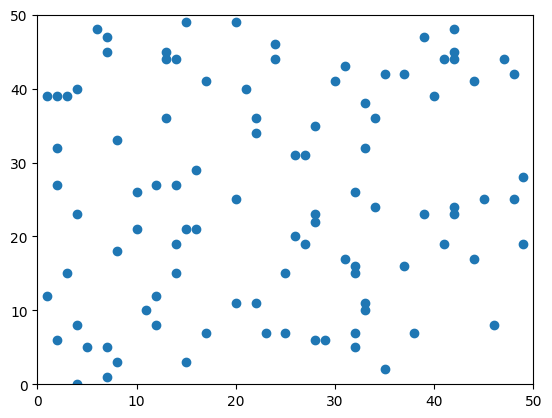

# Récupérer les sources

Ces fichiers sont conçus comme une base pour les TP de la toolbox PRPD.
+ [utils.py](utils.py) contient des fonctions de base pour manipuler les points, les ensembles de points, les trier, calculer des coordonnées polaires, etc.
+ [exhaustive.py](exhaustive.py) contient une fonction de calcul de l'enveloppe convexe par force brute : on examine chaque sous-ensemble de points possible et on teste s'il contient tous les autres points
+ [test.py](test.py) contient un petit script de test sur un ensemble de quelques points, avec l'approche naive (à étendre lors du TP).
+ [benchmark.py](benchmark.py) contient une fonction pour effectuer des campagnes d'expérimentations avec plusieurs algorithmes.

# Configurer son environnement python

Nous aurons besoin des libraires suivantes :
+ matplolib
+ itertools

# Exercices

1. Prendre en main les fichiers fournis
2. Implémenter l'algorithme de Graham dans un nouveau fichier 
3. Implémenter l'algorithme de Jarvis dans un nouveau fichier, puis comparer aux précédents
4. Implémenter l'algorithme de Shamos dans un nouveau fichier, puis comparer aux précédents
5. Implémenter l'algorithme d'Eddy-Floyd dans un nouveau fichier, puis comparer aux précédents

